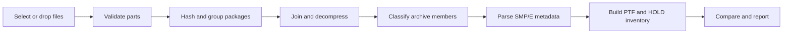

# SMP/E PTF Package Analyzer

[](https://github.com/kritoaincrad/smpe-ptf-package-analyzer/actions/workflows/windows-build.yml)


[](LICENSE)

A native desktop application for inspecting IBM z/OS SMP/E service packages.
It joins split deliveries, safely decompresses and inspects package contents,
extracts PTF and HOLD metadata, compares releases, and produces corporate reports.

The analyzer is built with Python and PySide6/Qt. Package processing takes place
locally on the workstation; no browser or application server is required.

> [!IMPORTANT]
> This is an independent project and is not developed, endorsed, or supported by
> IBM or BMC. Product names are used only to describe compatible package formats.

## Highlights

- Detects, validates, numerically sorts, and joins split `.XofY` deliveries
- Decompresses Unix `.Z` streams with a built-in LZW decoder and fallback chain
- Reads PAX, TAR, GZIP, and nested GIMZIP-style package structures
- Parses SMPPTFIN, SMPMCS, HOLDDATA, GIMFAF, and GIMPAF metadata
- Extracts PTFs, APARs, FMIDs, dependencies, elements, descriptions, and HOLDs
- Identifies PE (PTF in error) status from critical `ERROR HOLD` records
- Provides search, sorting, configurable columns, and reusable filter profiles
- Includes polished light and dark themes for the complete desktop interface
- Stores analysis history with labels, notes, archive state, and SHA-256 fingerprints
- Compares two deliveries at added, removed, and changed PTF level
- Exports CSV, JSON, multi-sheet Excel, printable PDF, and individual PTF reports
- Generates executive summaries with PE, critical HOLD, and action-required sections
- Supports company name, report title, and logo customization
- Masks local paths, network paths, email addresses, and IP addresses in exports
- Offers optional SQLCipher database encryption and enforced offline analysis
- Supports signed update manifests, Windows notifications, and database backup/restore

## How it works



Analysis runs on a background worker thread. The interface remains responsive
during large decompression and parsing jobs while displaying the current stage,
percentage, elapsed time, and live structured logs. An active analysis can be
cancelled safely.

## Requirements

- Windows 10 or Windows 11
- Python 3.11 or later
- `pip` for dependency installation

Core dependencies are defined in [`requirements.txt`](requirements.txt):

| Package | Purpose |
|---|---|
| `PySide6` | Native Qt desktop interface |
| `pandas` | Tabular analysis and export data |
| `openpyxl` | Excel report generation |
| `cryptography` | Ed25519 update-manifest verification |
| `unlzw3` | Optional secondary Unix `.Z` decoder |

The application includes its own LZW decoder, so Unix `.Z` packages can be
processed without `unlzw3` or 7-Zip.

## Quick start

Clone the repository and create an isolated environment:

```powershell
git clone https://github.com/kritoaincrad/smpe-ptf-package-analyzer.git
cd smpe-ptf-package-analyzer

py -3.11 -m venv .venv
.\.venv\Scripts\Activate.ps1
python -m pip install --upgrade pip
python -m pip install -r requirements.txt
```

Launch the desktop application:

```powershell
python desktop_app.py
```

Files can be dropped onto the application or selected through **File > Add files**
and **File > Add folder**. Exact file paths may also be passed at startup:

```powershell
python desktop_app.py "C:\Packages\delivery.1of3" "C:\Packages\delivery.2of3" "C:\Packages\delivery.3of3"
```

## Supported delivery structures

| Structure | Example | Behavior |
|---|---|---|
| Single package | `delivery.pax.Z` | Detected and processed directly |
| Split package | `delivery.1of3` ... `delivery.3of3` | Joined in numeric order |
| Naming variants | `.01OF07`, `_3of4`, `-1 of 2` | Part number and total are recognized |
| PAX/TAR | `.pax`, `.tar` | Archive is read directly |
| GZIP | `.gz` | Format is detected and decompressed |
| Nested package | GIMZIP-style archive | Traversed up to the configured depth |
| TSO XMIT | `INMR01` stream | Recognized but not unpacked |

Part validation occurs before analysis begins. Missing parts, conflicting content
for the same part number, inconsistent totals, and duplicate deliveries are shown
as clear status messages.

## Desktop interface

| View | Purpose |
|---|---|
| **Summary** | Package status, format, decoder, encoding, size, and warnings |
| **PTFs** | Searchable PTF table with FMID, PE, and HOLD filters plus detail pane |
| **HOLDDATA** | HOLD and RELEASE records with critical ERROR HOLD highlighting |
| **Package contents** | Archive members, roles, and GIMFAF/GIMPAF metadata |
| **Logs** | Structured logs filterable by severity |
| **History** | Stored analyses, labels, notes, and archive state |
| **Compare** | PTF-level differences between two analyses |
| **Inventory** | PTF/FMID visibility and repeated package fingerprints |

Additional workflow features include:

- Explorer drag and drop with optional recursive folder discovery
- Recently used input and export directories
- Persistent column visibility and reusable PTF filter profiles
- Native completion notifications when the application is in the background
- Dark mode with complete hover, focus, selected, and disabled states
- A decoder diagnostics window showing availability and fallback priority

## Reporting

The application can produce:

- CSV exports of the filtered PTF list
- JSON exports of the complete analysis record
- CSV exports of structured analysis logs
- Multi-sheet, filterable Excel workbooks
- Printable corporate PDF reports
- Print previews for individual PTF details

Corporate reports may include an executive summary, package and PTF totals,
in-error PTFs, critical HOLDs, required actions, and delivery comparison results.

Configure the company name, report title, and logo through:

```text
Tools > Report branding...
```

The same settings are available under **Tools > Preferences > Reports**. After an
analysis completes, reports can be created through **File > Corporate report**.

## Analysis history and inventory

Analysis history is stored in a local SQLite database by default:

```text
%LOCALAPPDATA%\PTFAnalyzer\analyses.db
```

Set `PTFANALYZER_DB` to use a different location. The database contains analysis
summaries, package fingerprints, a searchable PTF index, and the records required
to reopen an analysis. Large temporary archive data and raw workspace files are
not persisted.

The History and Inventory views can:

- Rename, annotate, archive, and reopen analyses
- Find the first and last delivery in which a PTF appeared
- Detect packages uploaded more than once by SHA-256 fingerprint
- Browse inventory by PTF and FMID
- Back up the database and restore it after an integrity check

Raw MCS statement objects are intentionally excluded from stored analyses because
they are large and reproducible. As a result, **Raw MCS** may be empty when an old
analysis is reopened.

## Security and privacy

- Packages are processed locally; offline analysis is enabled by default.
- The offline guard blocks outbound socket connections while analysis is running.
- Archive traversal attempts, excessive member counts, oversized members, and
  abnormal expansion ratios are rejected.
- Temporary workspace files are removed when processing ends.
- Export redaction can mask Windows, UNC, and home-directory paths, email addresses,
  and IPv4 addresses.
- Update checks accept only a configured HTTPS manifest with a valid Ed25519 signature.
- Database keys, signing certificates, and passwords are never stored in the repository.

> [!WARNING]
> Package analysis involves parsing untrusted input. Keep the safety limits enabled,
> verify the source of each delivery, and ensure sufficient free disk space before
> processing very large packages.

### Optional database encryption

Install a SQLCipher-compatible Python driver such as `sqlcipher3` or `pysqlcipher3`,
then provide the key through the process environment:

```powershell
$env:PTFANALYZER_DB_KEY = "your-strong-secret"
python desktop_app.py
```

Enable **Preferences > Security > Encrypt history database with SQLCipher** and
restart the application. The key is not written to QSettings or the database.

## Environment variables

| Variable | Purpose |
|---|---|
| `PTFANALYZER_DB` | Overrides the SQLite/SQLCipher database path |
| `PTFANALYZER_DB_KEY` | Supplies the SQLCipher history database key |
| `PTFANALYZER_UPDATE_MANIFEST_URL` | HTTPS URL of the signed update manifest |
| `PTFANALYZER_UPDATE_PUBLIC_KEY` | Base64-encoded Ed25519 public key |
| `SIGN_PFX_PATH` | PFX certificate path for a local Windows build |
| `SIGN_PFX_PASSWORD` | Password for the PFX certificate |

## Building the Windows executable

Install PyInstaller and run the build script:

```powershell
python -m pip install -r requirements.txt pyinstaller
.\scripts\build_windows.ps1 -Version "2.0.0"
```

The executable is written to:

```text
dist\PTF-Analyzer-2.0.0.exe
```

The script prints the final SHA-256 hash. When `SIGN_PFX_PATH` and
`SIGN_PFX_PASSWORD` are set, it signs the executable with SHA-256 and a trusted
timestamp through Windows SDK `signtool.exe`, then verifies the signature.

### GitHub Actions

The [Windows desktop build workflow](.github/workflows/windows-build.yml) can be
started manually from **Actions > Windows desktop build > Run workflow**. The
requested version is built and uploaded as a workflow artifact.

For a signed artifact, configure these repository secrets:

| Secret | Content |
|---|---|
| `SIGN_PFX_BASE64` | Base64 representation of the PFX file |
| `SIGN_PFX_PASSWORD` | PFX certificate password |

The workflow still produces an executable when these secrets are absent, but the
artifact will be unsigned.

## Architecture

The analysis engine has no Qt dependency. The desktop layer consumes its models
and progress events without coupling package parsing to the interface.

```text
desktop_app.py
├── desktop/                 PySide6 desktop application
│   ├── main_window.py       Main window and user workflows
│   ├── models.py            Qt table and proxy models
│   ├── widgets.py           Reusable interface components
│   ├── preferences.py       Categorized application settings
│   ├── theme.py             Light/dark theme and interaction states
│   └── worker.py            Background analysis workers
├── ptfanalyzer/             UI-independent analysis engine
│   ├── parts.py             Part discovery, validation, and SHA-256
│   ├── compression.py       Format detection and .Z decoder chain
│   ├── archive.py           Safe PAX/TAR and nested archive handling
│   ├── records.py           Fixed-record processing
│   ├── mcs.py / smpe.py     SMP/E statement and SYSMOD analysis
│   ├── database.py          History and inventory persistence
│   ├── reporting.py         Excel and printable PDF reporting
│   └── security.py          Redaction and offline enforcement
└── scripts/
    └── build_windows.ps1    Windows packaging and code signing
```

## Decoder fallback order

Unix `.Z` decoders are attempted until one succeeds:

1. `unlzw3`, when installed
2. Built-in pure-Python LZW decoder
3. 7-Zip (`7z`, `7za`, or `7zz`)
4. System `uncompress`, `gzip`, or `zcat`

If a decoder fails, the error is recorded and the next available option is tried.
When every decoder fails, the application presents likely causes such as a missing
part, incorrect ordering, truncation, or an ASCII-mode FTP transfer.

## Known limitations

- TSO XMIT (`INMR01`) streams are identified but not unpacked. The data set must be
  processed with `RECEIVE` on z/OS first.
- The rarely used Unix `compress` configuration with `max_bits = 9` is unsupported.
  Real service packages generally use 12–16 bits.
- Raw MCS statement objects are not stored in analysis history.
- Encrypted history requires a separate SQLCipher-compatible Python driver.
- Trusted Windows releases require Windows SDK and a valid code-signing certificate.

## Contributing

Issues and pull requests are welcome. When contributing:

1. Describe the scope and expected behavior clearly.
2. Never commit customer packages, private paths, email addresses, IP addresses,
   certificates, passwords, or encryption keys.
3. Use only synthetic, redistributable fixtures when sample data is required.
4. Verify interface changes in both light and dark mode.
5. Confirm that the Windows executable build completes successfully.

Do not disclose sensitive package data or logs in a public security issue. Use the
repository owner's private contact channel for responsible disclosure.

## License

Distributed under the [MIT License](LICENSE).
