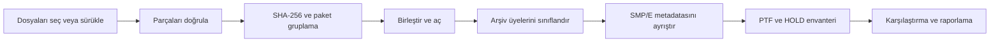

# SMP/E PTF Package Analyzer


IBM z/OS için hazırlanmış, yerel çalışan bir SMP/E servis paketi analiz uygulaması.
BMC ve IBM tarzı `.pax.Z`, Unix `.Z` ve bölünmüş `.XofY` teslimatlarını birleştirir,
paket içeriğini güvenli biçimde açar ve SMP/E metadatasını masaüstü arayüzünde
incelenebilir hale getirir.

Uygulama PySide6/Qt tabanlıdır. Analiz işlemleri kullanıcının bilgisayarında yapılır;
web sunucusu veya tarayıcı gerektirmez.

> [!IMPORTANT]
> Bu proje IBM veya BMC tarafından geliştirilmiş ya da desteklenen resmî bir ürün
> değildir. Ürün ve marka adları yalnızca desteklenen paket biçimlerini açıklamak
> amacıyla kullanılmıştır.

## Öne çıkan özellikler

- `.XofY` parçalarını algılama, numerik sıralama ve eksik/çakışan parça kontrolü
- Unix `.Z` için dahili LZW decoder ve yapılandırılabilir fallback zinciri
- PAX, TAR, GZIP ve iç içe GIMZIP tarzı arşivleri inceleme
- SMPPTFIN, SMPMCS, HOLDDATA, GIMFAF ve GIMPAF metadata analizi
- PTF, APAR, FMID, PRE, REQ, SUP, element, HOLD ve açıklama çıkarımı
- Kritik `ERROR HOLD` kayıtlarından PE (PTF in error) tespiti
- Arama, sıralama, sütun seçimi ve yeniden kullanılabilir filtre profilleri
- Açık/koyu tema ve tüm analiz boyunca yanıt veren yerel masaüstü arayüzü
- Analiz geçmişi, not/etiket/arşivleme ve SHA-256 tabanlı tekrar teslimat tespiti
- İki teslimat arasında eklenen, kaldırılan ve değişen PTF karşılaştırması
- CSV, JSON, Excel ve PDF dışa aktarma; yazdırılabilir PTF detayları
- Yönetici özeti, kritik HOLD ve aksiyon bölümleri içeren kurumsal raporlar
- Firma adı, rapor başlığı ve logo ile rapor özelleştirme
- Rapor ve loglarda yerel yol, e-posta ve IP adresi maskeleme
- İsteğe bağlı SQLCipher veritabanı şifrelemesi
- Çevrimdışı analiz modu ve imzalı güncelleme manifesti desteği
- Windows bildirimleri, veritabanı yedekleme ve doğrulanmış geri yükleme

## Uygulama akışı



Analiz ayrı bir worker thread üzerinde çalışır. Uzun süren açma ve ayrıştırma
işlemleri sırasında arayüz kullanılabilir kalır; aşama, yüzde, geçen süre ve canlı
log bilgisi gösterilir. İşlem gerektiğinde iptal edilebilir.

## Gereksinimler

- Windows 10 veya Windows 11
- Python 3.11 veya üzeri
- Bağımlılıkları kurmak için `pip`

Temel bağımlılıklar `requirements.txt` içinde tutulur:

- `PySide6`: yerel Qt arayüzü
- `pandas`: tablo ve rapor verisi
- `openpyxl`: Excel çıktısı
- `cryptography`: imzalı güncelleme doğrulaması
- `unlzw3`: isteğe bağlı ikinci `.Z` decoder

Uygulamanın kendi LZW decoder'ı bulunduğu için `unlzw3` veya 7-Zip olmadan da
Unix `.Z` dosyaları işlenebilir.

## Kurulum

Depoyu GitHub'daki **Code** düğmesiyle klonlayın veya ZIP olarak indirin. Ardından
proje klasöründe bir sanal ortam oluşturun:

```powershell
py -3.11 -m venv .venv
.\.venv\Scripts\Activate.ps1
python -m pip install --upgrade pip
python -m pip install -r requirements.txt
```

Uygulamayı başlatın:

```powershell
python desktop_app.py
```

Dosyalar arayüze sürüklenebilir veya **File > Add files / Add folder** üzerinden
seçilebilir. İstenirse tam dosya yolları başlangıçta argüman olarak verilebilir:

```powershell
python desktop_app.py "C:\Packages\delivery.1of3" "C:\Packages\delivery.2of3" "C:\Packages\delivery.3of3"
```

## Desteklenen teslimat yapıları

| Yapı | Örnek | Davranış |
|---|---|---|
| Tek parça | `delivery.pax.Z` | Doğrudan algılanır ve analiz edilir |
| Bölünmüş paket | `delivery.1of3` ... `delivery.3of3` | Numerik sırayla birleştirilir |
| Büyük/küçük harf varyasyonu | `.01OF07`, `_3of4`, `-1 of 2` | Parça numarası ve toplam sayı algılanır |
| PAX/TAR | `.pax`, `.tar` | Arşiv doğrudan okunur |
| GZIP | `.gz` | Format algılanarak açılır |
| İç içe paket | GIMZIP tarzı arşiv | Ayarlanan derinliğe kadar taranır |
| TSO XMIT | `INMR01` imzalı akış | Tanınır, ancak açılmaz |

Parça doğrulaması analiz başlamadan önce yapılır. Eksik parça, aynı sıra numarasıyla
farklı içerik, tutarsız toplam parça sayısı ve yinelenen teslimatlar açık durum
mesajlarıyla gösterilir.

## Analiz ekranları

| Ekran | İçerik |
|---|---|
| **Summary** | Paket durumu, format, decoder, encoding, boyut ve uyarılar |
| **PTFs** | Aranabilir PTF listesi, FMID/PE/HOLD filtreleri ve detay görünümü |
| **HOLDDATA** | HOLD ve RELEASE kayıtları; kritik ERROR HOLD vurguları |
| **Package contents** | Arşiv üyeleri, roller ve GIMFAF/GIMPAF metadatası |
| **Logs** | Seviyeye göre filtrelenebilen yapılandırılmış analiz logları |
| **History** | Kaydedilmiş analizler, notlar, etiketler ve arşiv durumu |
| **Compare** | İki analiz arasındaki PTF farkları |
| **Inventory** | PTF/FMID görünürlüğü ve yinelenen paket fingerprint'leri |

## Raporlama

Uygulama aşağıdaki çıktıları üretebilir:

- Filtrelenebilir PTF listesi için CSV
- Tam analiz kaydı için JSON
- Yapılandırılmış loglar için CSV
- Birden fazla çalışma sayfasına sahip Excel raporu
- Yazdırılabilir kurumsal PDF raporu
- Seçilen PTF için baskı önizlemesi

Excel ve PDF raporlarında yönetici özeti, paket/PTF sayaçları, PE kayıtları,
kritik HOLD'lar ve karşılaştırma sonuçları bulunabilir. Firma adı, başlık ve logo
**Tools > Preferences > Reports** bölümünden ayarlanır.

## Geçmiş ve yerel veri

Analiz geçmişi varsayılan olarak yerel bir SQLite veritabanında saklanır:

```text
%LOCALAPPDATA%\PTFAnalyzer\analyses.db
```

Konum `PTFANALYZER_DB` ortam değişkeniyle değiştirilebilir. Veritabanı;
analiz özetlerini, paket fingerprint'lerini, aranabilir PTF indeksini ve raporun
yeniden açılması için gerekli kayıtları içerir. Ham ve büyük geçici arşiv verileri
saklanmaz.

History ekranından:

- analizler yeniden adlandırılabilir, notlandırılabilir ve arşivlenebilir,
- bir PTF'nin ilk ve son görüldüğü teslimatlar bulunabilir,
- yinelenen paket fingerprint'leri görüntülenebilir,
- veritabanı yedeklenebilir ve bütünlük kontrolünden sonra geri yüklenebilir.

## Güvenlik ve gizlilik

- Paketler yerel olarak işlenir; varsayılan analiz modu çevrimdışıdır.
- Çevrimdışı koruma analiz süresince outbound socket bağlantılarını engeller.
- Arşiv traversal girişimleri, aşırı member sayısı ve çok büyük member'lar reddedilir.
- Geçici çalışma dosyaları analiz workspace'i kapatılırken temizlenir.
- Rapor ve log maskelemesi Windows/UNC/home yollarını, e-postaları ve IPv4
  adreslerini anonimleştirebilir.
- Güncelleme kontrolü yalnızca yapılandırılmış HTTPS manifestini ve geçerli
  Ed25519 imzasını kabul eder.
- Sertifika, veritabanı anahtarı ve benzeri sırlar repoya kaydedilmez.

> [!WARNING]
> Paket analizi güvenilmeyen verilerin ayrıştırılmasını içerir. Limitleri kapatmadan
> önce kaynağın güvenilir olduğundan emin olun ve büyük teslimatları yeterli boş disk
> alanına sahip bir sistemde çalıştırın.

### Opsiyonel veritabanı şifrelemesi

SQLCipher uyumlu bir Python sürücüsü (`sqlcipher3` veya `pysqlcipher3`) kurun,
ardından anahtarı yalnızca çalışma ortamına verin:

```powershell
$env:PTFANALYZER_DB_KEY = "your-strong-secret"
python desktop_app.py
```

Son olarak **Preferences > Security > Encrypt history database with SQLCipher**
seçeneğini etkinleştirin ve uygulamayı yeniden başlatın. Anahtar QSettings'e veya
veritabanına yazılmaz.

## Yapılandırma değişkenleri

| Değişken | Amaç |
|---|---|
| `PTFANALYZER_DB` | SQLite/SQLCipher veritabanı yolunu değiştirir |
| `PTFANALYZER_DB_KEY` | SQLCipher geçmiş veritabanı anahtarı |
| `PTFANALYZER_UPDATE_MANIFEST_URL` | İmzalı güncelleme manifestinin HTTPS adresi |
| `PTFANALYZER_UPDATE_PUBLIC_KEY` | Base64 kodlu Ed25519 public key |
| `SIGN_PFX_PATH` | Yerel Windows build'i için PFX sertifika yolu |
| `SIGN_PFX_PASSWORD` | PFX sertifika parolası |

## Windows executable oluşturma

PyInstaller'ı kurun ve build betiğini çalıştırın:

```powershell
python -m pip install -r requirements.txt pyinstaller
.\scripts\build_windows.ps1 -Version "2.0.0"
```

Çıktı:

```text
dist\PTF-Analyzer-2.0.0.exe
```

Betik build sonunda SHA-256 değerini yazdırır. `SIGN_PFX_PATH` ve
`SIGN_PFX_PASSWORD` tanımlıysa Windows SDK içindeki `signtool.exe` kullanılarak
binary SHA-256 ve güvenilir timestamp ile imzalanır; imza daha sonra doğrulanır.

### GitHub Actions ile build

`.github/workflows/windows-build.yml` workflow'u **Actions > Windows desktop
build > Run workflow** üzerinden sürüm numarası verilerek manuel çalıştırılabilir.
Üretilen `.exe` workflow artifact'i olarak yüklenir.

İmzalı artifact için repository secrets bölümüne aşağıdaki değerleri ekleyin:

| Secret | İçerik |
|---|---|
| `SIGN_PFX_BASE64` | PFX dosyasının Base64 içeriği |
| `SIGN_PFX_PASSWORD` | PFX parolası |

Bu secrets tanımlı değilse build tamamlanır ancak executable imzasız olur.

## Mimari

Analiz motoru Qt'den bağımsızdır; masaüstü katmanı yalnızca motorun modellerini ve
olaylarını görüntüler.

```text
desktop_app.py
├── desktop/                 PySide6 masaüstü uygulaması
│   ├── main_window.py       Ana pencere ve kullanıcı akışları
│   ├── models.py            Qt tablo/proxy modelleri
│   ├── widgets.py           Yeniden kullanılabilir bileşenler
│   ├── preferences.py       Kategorili ayarlar penceresi
│   ├── theme.py             Açık/koyu tema ve etkileşim durumları
│   └── worker.py            Arka plan analiz işleri
├── ptfanalyzer/             UI'dan bağımsız analiz motoru
│   ├── parts.py             Parça algılama, doğrulama ve SHA-256
│   ├── compression.py       Format tespiti ve .Z decoder zinciri
│   ├── archive.py           Güvenli PAX/TAR ve nested arşiv işleme
│   ├── records.py           Fixed-record ayrıştırma
│   ├── mcs.py / smpe.py     SMP/E statement ve SYSMOD analizi
│   ├── database.py          Geçmiş ve envanter
│   ├── reporting.py         Excel/PDF raporlama
│   └── security.py          Maskeleme ve çevrimdışı koruma
└── scripts/
    └── build_windows.ps1    Windows executable üretimi ve imzalama
```

## Decoder sırası

Unix `.Z` akışları için decoder'lar ilk başarılı sonuç alınana kadar denenir:

1. `unlzw3` (kuruluysa)
2. Dahili saf Python LZW decoder
3. 7-Zip (`7z`, `7za` veya `7zz`)
4. Sistem `uncompress`, `gzip` veya `zcat` araçları

Bir decoder başarısız olduğunda hata loglanır ve sıradaki seçenek denenir. Tüm
seçenekler başarısız olursa kullanıcıya eksik parça, hatalı sıra veya ASCII FTP
aktarımı gibi muhtemel nedenleri içeren anlaşılır bir hata gösterilir.

## Bilinen sınırlamalar

- TSO XMIT (`INMR01`) akışları tanınır ancak açılmaz; veri seti önce z/OS üzerinde
  `RECEIVE` edilmelidir.
- Unix `compress` formatındaki pratikte kullanılmayan `max_bits = 9` varyantı
  desteklenmez. Gerçek servis paketleri genellikle 12–16 bit kullanır.
- Ham MCS statement nesneleri geçmiş veritabanına kaydedilmez; kaydedilmiş bir
  analiz yeniden açıldığında **Raw MCS** sekmesi boş olabilir.
- Şifreli geçmiş için ayrıca SQLCipher uyumlu bir Python sürücüsü gerekir.
- Güvenilir Windows yayınları için kurulu Windows SDK ve geçerli bir code-signing
  sertifikası gerekir.

## Katkıda bulunma

Katkılar issue veya pull request üzerinden gönderilebilir. Bir değişiklik önerirken:

1. Kapsamı ve beklenen davranışı açıkça açıklayın.
2. Gerçek müşteri paketi, yerel yol, e-posta, IP, sertifika veya anahtar eklemeyin.
3. Test verisi gerekiyorsa yalnızca sentetik ve yeniden dağıtılabilir veri kullanın.
4. UI değişikliklerini hem açık hem koyu temada kontrol edin.
5. Windows executable build'inin tamamlandığını doğrulayın.

Güvenlik açığını herkese açık issue içinde gerçek paket veya hassas log paylaşarak
bildirmeyin; repository sahibinin özel iletişim kanalını kullanın.
